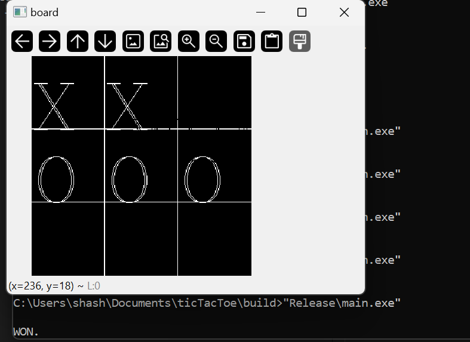
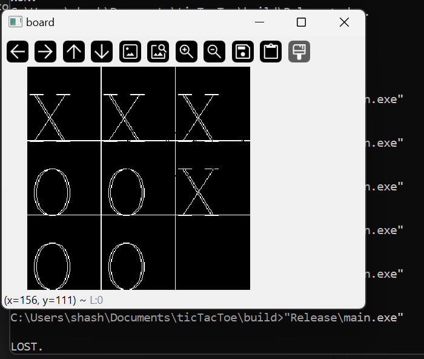

# Tic Tac Toe with Minimax Algorithm

## Introduction
This is a Tic Tac Toe game implemented using the Minimax algorithm in AI. The Minimax algorithm is a decision-making algorithm commonly used in two-player games to determine the best move for a player.

## Features
- Play Tic Tac Toe against an AI opponent using the Minimax algorithm.
- User plays 'O', AI 'X'(can be changed by minimal changes in code).
- The AI player uses Minimax to make optimal moves.

## Requirements
- C++ compiler
- OpenCV Installed.
- Terminal or Command Prompt

## How to Play
1. Clone the repository to your local machine.
2. Navigate to the project directory in your terminal or command prompt.
3. Generate build files using CMake, add OpenCV dir (for Windows).
4. run main.exe (run using terminal, win / lost messages are only shown on terminal).

## Screenshots
### User Wins

### AI Wins

